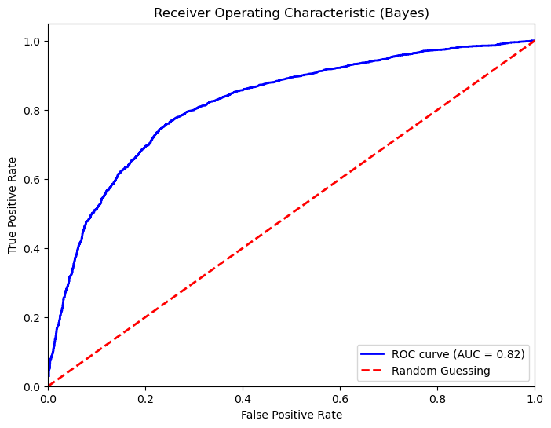
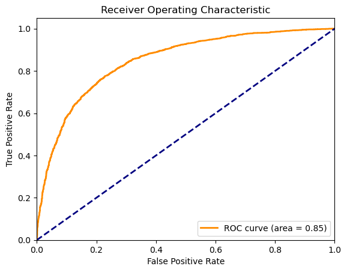

# **SEASONAL FLU VACCINE CLASSIFICATION PROJECT**

Influenza (flu) is a contagious respiratory illness caused by influenza viruses that infect the nose, throat, and lungs. Some people, such as people 65 years and older, young children, and people with certain health conditions, are at higher risk of serious flu complications thus the need for a vaccine. (CDC)
Last year, there were about 18000 deaths from seasonal flu in the US according to CDC.
Every person 6 months and above shoud be vaccinaated every season(December to Februaur)

Safaricom, through their m-tiba subsidiary wants to understand the leading factors in determining whether people would take the seasonal flu vaccine in order to put in the right strategies for their public efforts and vaccination campaigns to educate the public, raise awareness while maximizing vaccine intake.
My objective is to build a classifier to predict seasonal flu vaccination status using data they shared on their behaviours, opinions and demographic characteristics.

**DATA UNDERSTANDING AND CLEANING**.

The data was obtained from the National 2009 H1N1 Flu Survey. 
People were unterviewed through phone calls.
My target in this project will be seasonal_flu and predictors will be people's opinions, hevaviours and demographic features.

The variables with the highest number of null values were dropped.

Numerical variables with few null values were replaced with the median while categorical variables with the mode.

**DATA ANALYSIS AND VISUALIZATION
**

Distribution of our target variable.

Relationship between seasonal_vaccine and various attributes:

Correlation between seasonal_vaccine and the predictors.

From the analysis, we can conclude the following:

1. People with chronic health conditions.
2. Health worker profession.
3. Belief that the vaccine is efficacious.
4. Recommendation on the seasonal flu vaccine uptake by a doctor.
5. Awareness of the risks associated with the seasonal flu.
6. People over 65 years
7. People who wear facemasks and wash hands are more likely to take the seasonal flu vaccine

## MACHINE LEARNING

**FEATURE SELECTION**

We used the Chi square statistic test as the feature selection method using the 'SelectKBest' method from scikit-learn.

The predictors selected include:
'behavioral_large_gatherings', 'behavioral_face_mask', 'behavioral_wash_hands', 'opinion_seas_vacc_effective', 'opinion_seas_sick_from_vacc', 'education', 'age_group', 'seasonal_vaccine', 'chronic_med_condition', 'health_worker', 'doctor_recc_seasonal', 'behavioral_antiviral_meds', 'opinion_seas_risk'

### MODEL 1: DECISION TREE CLASSIFIER

Performance metrics:

Accuracy: 0.7190
Precision: 0.7098
Recall (Sensitivity): 0.6557
F1 Score: 0.6817
Specificity: 0.7727

ROC:

**Gradient Boosted Decision Tree classifier**:

Performance metrics:

Accuracy: 0.7798577311868214
Precision: 0.766402005850397
Recall (Sensitivity): 0.7482660138718891
Specificity: 0.8066413005880319

ROC:

### MODEL 2: GAUSSIAN NAIVE BAYES.

ROC:

### MODEL 3: RANDOM FOREST CLASSIFIER:

Performance metrics:

Accuracy: 0.7414825907899663
Precision: 0.718189233278956
Sensitivity (Recall): 0.7184822521419829
Specificity: 0.7609823590453131

ROC

**HYPERPARAMETER TUNED RANDOM FOREST**

We did hyperparameter tuning using GridSearchCV

Performance metrics:
Accuracy: 0.7414825907899663
Precision: 0.718189233278956
Sensitivity (Recall): 0.7184822521419829
Specificity: 0.7609823590453131

ROC

### WHICH MODEL TO USE?

Comparison in performance:

Based on this, the best model to use for the classification is the gradient boosted Decision Tree classifier

## RECOMMENDATIONS

**Emphasize vaccine efficacy**. Highlight the effectiveness of the vaccine in preventing flu-related complications while at the same time **raising awareness on the risks associated with seasonal flu**.

**Promote Doctor recommendations**. Encourage healthcare providers to recommend seasonal flu vaccinationa to their patients, especially those with **chronic health conditions**.

Impliment targeted vaccination campaigns aimed at **older people**. Avail more vaccines to nursing homes.

Promote **hygiene practises such as wearing facemasks and washing hands**. These seem to promote health seeking behaviour consequently leading to increased uptake of the seasonal flu vaccine.
